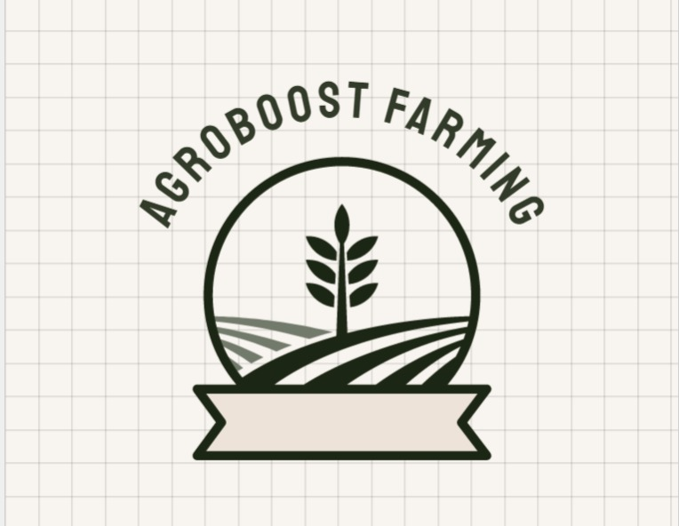

<!-- PROJECT LOGO -->
<br />
<p align="center">
    
  </a>

  <h2 align="center">AgroBoost</h2>
  <h5 align="center"><em>(Using MERN stack)</em></h5>
</p>


Annadata is a full-stack cross-platform application that provides complete assistance to farmers right from sowing to harvesting.
Some of its features are

1. Using ML technology for plant disease detection from image and recommending crops to grow based on farmer's location

2. Real-time information about soil fertility, weed risk, fire alert, weather forecast, and air quality to make the right farming decisions

3. Detailed cost analysis of growing crop explaining investment required and potential revenue generated along with suggesting other income sources

4. Option to buy/sell/rent farming equipment

5. Farmers' community section having chat option, video upload, QnA, and many more other features to make our platform interactive

## Installation

 Clone the repo
 
```sh
git clone https://github.com/Sandesh040602/gfg-hackathon.git
```

To install all frontend dependencies, backend dependencies and concurrently. Run

```sh
npm run install-all
```

To start backend and frontend server. Run

```sh
npm run dev
```

## Tech stack used

- [React](https://reactjs.org/) for frontend

- [Node.js](https://nodejs.org/) for backend

- [Flask](https://flask.palletsprojects.com/en/2.0.x/) for AI backend

- [Ambeedata API](https://docs.ambeedata.com/#soil-latest-geospatial) for
 realtime information about soil, pollen, fire alert, air quality, water
 vapour and weather information.

- [Open Weather API](https://openweathermap.org/api) for weather forecast

- [Twilio](https://www.twilio.com/) for sending SMS

- [Node Mailer](https://nodemailer.com/about/) for sending email

- [Cloudinary](https://cloudinary.com/) for storing media files like photos
 and videos

- [MongoDB](https://www.mongodb.com/) for database

- [JWT](https://jwt.io/) for secure authentication

- [Zulip API](https://zulip.com/api/running-bots) for Zulip Chat bot

## Photos

### Home Page


### About


### Location


### Crop Suggest


